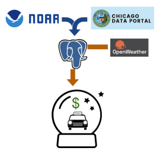

# Taximizer
### Forecasting Taxi Income

Taximizer is a batching pipeline, database, and web app which predicts taxi income for different areas in Chicago. Historical data for taxi trips and weather from 2013 onwards are aggregated and combined with the weather forecast, time of day, and day of week to estimate taxi ride income over the next 48 hours. 

[Taximizer web app](taximizer.dataparade.xyz)  |  [Taximizer Slides](https://docs.google.com/presentation/d/1ozqR8Iqtho02ZE-h22gvEz2AM5OwbfHrJrgAp0_lbk4/edit?usp=sharing)  |  [Recorded Demo](https://www.youtube.com/watch?v=RlZl1Vz8Lok)

## Installation

Use `RunSpark.sh` to aggregate historical data for Taximizer. The script requires Spark running on a distributed cluster, input .csv data files stored in an S3 bucket, and a PostgreSQL database to store the output tables.

To update the current forecast table every 15 minutes, install Airflow and run `task-scheduling/forecast_dag.py`.

The frontend application runs in Python 3 with Plotly/Dash.

## Architecture

Data from the Chicago Data Portal and NOAA are stored in S3. Data aggregation and joining is performed in a Spark batching job. Summary tables are written to PostgreSQL. Airflow coordinates a Python script to join the current weather forecast with the historical data tables. The frontend display is created with Plotly.

## Datasets
Taxi ride data from 2013 onward is available at the [Chicago Data Portal](https://data.cityofchicago.org/Transportation/Taxi-Trips/wrvz-psew). The dataset is currently ~70 GB. Climate data for the past 40+ years is available from [NOAA](https://www.ncdc.noaa.gov/cdo-web/datasets). Current weather and forecast data is obtained from the [OpenWeatherMap](https://openweathermap.org/) API.

## Challenges
Challenges in developing the app included: 
* handling inexact matches between forecast and historical weather
* determining aggregation workflow for efficiency and proper statistics
* optimizing Dataframe read, persist, and partition behavior to speed up Spark job