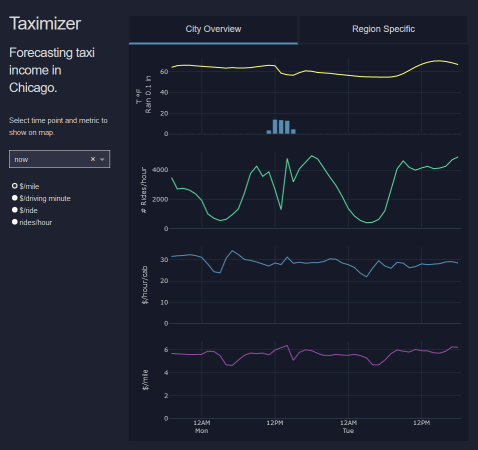
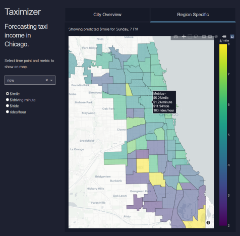

# Taximizer Application

The [Taximizer web app](https://taximizer.dataparade.xyz/) was built with Plotly/Dash. The theme was modelled after the [Manufaturing SPC Dashboard](https://dash-gallery.plotly.host/dash-manufacture-spc-dashboard/) example from the [Dash Gallery](https://dash-gallery.plotly.host).

The left column contains a dropdown for selecting the timepoint and metric to be shown in the region specific map. Data is shown in the right column on two tabs:

1. City overview tab which shows aggregate statistics for all of Chicago:
    * Temperature and precipitation from the weather forecast
    * Expected number of rides/hour
    * Expected $/hour/cab
    * Expected $/mile

    
    
2. Region specific tab which shows a choropleth map of the city for a single metric at a single point in time
    * Expected $/mile
    * Expected $/minute of driving
    * Expected $/ride
    * Expected rides/hour

    