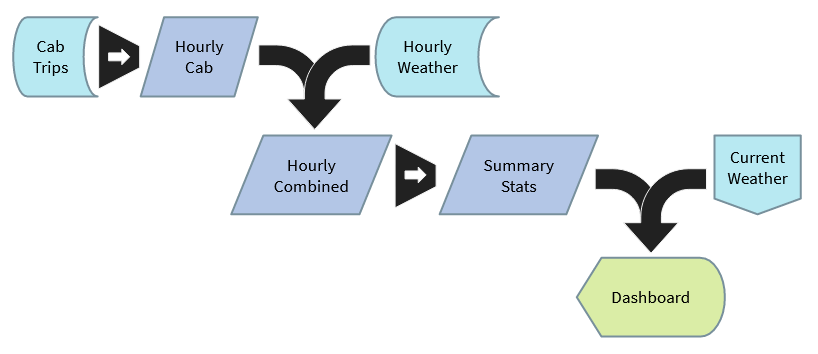

# Data processing for Taximizer

Batch processing of the historical data was performed in Spark running on a distributed cluster. The cluster used consisted of 1 m5.large controller and 4 c5.large workers. With this cluster setup processing takes ~11.5 minutes. 

Data aggregation occurs in three main steps: 
1. The cab data is aggregated from 1 record per ride to 1 record per hour per region
1. The hourly cab data is joined to hourly weather data
1. The joined hourly data is aggregated again from 1 record per hour to 1 record per [day, hour, area, temperature, precipitation] combination

Processing the current forecast is done with Python in order to take advantage of the as-of join in Pandas. The current weather data is retrieved from the Open Weather Map API, binned to be consistent with the batch aggregation, and joined to the history tables. The joined data is save back to PostgreSQL.